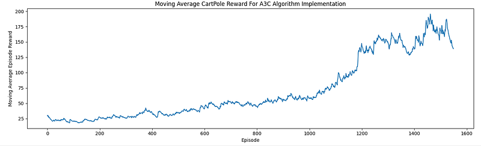

# Bioengineering-A3C
This is the supporting code for for an A3C implementation and discussion to be found on Medium. This repository and the associated article were undertaken as part of the Reinforcement Learning module within the Human & Biological Robotics course at Imperial College London, December 2024. 

## Repository overview
This project is heavily inspired by the work carried out by Morvan Zhou (https://github.com/MorvanZhou/pytorch-A3C) to create a simple, discrete A3C reinforcement learning solution to solve the CartPole environment. 

Although some of the hyperparamters have been adjusted, this repository is currently a work in progress, and overall performance can still be improved. A sample of the learning curve generated by this solution can be seen below:

## Dependencies
- Python 3.11
- pytorch
- gymnasium
- numpy
- matplotlib
